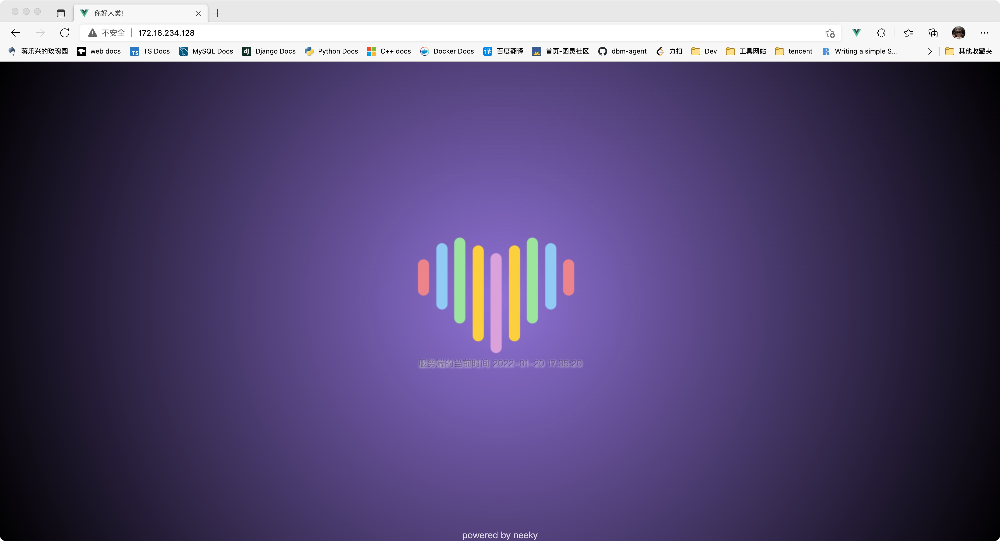

## 背景

最近因为工作上的一些原因要把之前的技术栈切到 JAVA ，团队里面现在用的是 spring 全家桶 ；短期来看主要的开发任务应该还是 JAVA 全栈开发，不管别的了先把环境搞起来。

|**组件/软件/框架**|**具体实体**|
|---------------|---------------|
| web 服务器     |      nginx    |
| 应用服务器      |   springboot(自带) |
| 前端框架       |    vue        |


也不能为了搞而搞，还是实现一个需求吧，前端每秒从服务端请求一次当前的时间，并更新到页面，最终的效果如下。



---


## 第一步 解决依赖

先别管这个么把 linux 上的依赖解决了再说。

```bash
yum -y install gcc gcc-c++ libffi libyaml-devel libffi-devel zlib zlib-devel openssl shadow-utils net-tools openssl-devel libyaml sqlite-devel libxml2 libxslt-devel libxml2-devel wget vim 
```

---

## 第二步 配置 nginx
下载&编译安装 nginx 。
```bash
# 下载
cd /tmp/ 
wget https://nginx.org/download/nginx-1.18.0.tar.gz

# 编译
tar -xvf nginx-1.18.0.tar.gz
cd nginx-1.18.0/
./configure --prefix=/usr/local/nginx-1.18.0 && make && make install

# 配置
cd /usr/local/
ln -s nginx-1.18.0 nginx
echo 'export PATH=/usr/local/nginx/sbin:$PATH\n' >> /etc/profile
source /etc/profile

# 用 nginx 用户运行 nginx 进程
useradd nginx
chown -R nginx:nginx /usr/local/nginx-1.18.0

```
---

## 第三步 配置 java
下载配置 java 。
```bash
# 下载
cd /tmp/
wget https://github.com/Tencent/TencentKona-8/releases/download/8.0.8-GA/TencentKona8.0.8.b1_jdk_linux-x86_64_8u312.tar.gz
tar -xvf TencentKona8.0.8.b1_jdk_linux-x86_64_8u312.tar.gz -C /usr/local/
echo 'export JAVA_HOME=/usr/local/TencentKona-8.0.8-312/\n' >> /etc/profile
echo 'export PATH=/usr/local/TencentKona-8.0.8-312/bin/:$PATH\n' >> /etc/profile
```
---

## 第四步 编译项目
springboot 会把应用服务器也打到编译好的 jar 文件中，所以整体上来讲简单不少。
```bash
cd hellospring

mvn package
[INFO] Scanning for projects...
[INFO] 
[INFO] -----------------< com.sqlpy.hellospring:hellospring >------------------
[INFO] Building hellospring 0.0.1-SNAPSHOT
[INFO] --------------------------------[ jar ]---------------------------------
[INFO] 
[INFO] --- maven-resources-plugin:3.2.0:resources (default-resources) @ hellospring ---
[INFO] Using 'UTF-8' encoding to copy filtered resources.
[INFO] Using 'UTF-8' encoding to copy filtered properties files.
...
...
[INFO] Results:
[INFO] 
[INFO] Tests run: 1, Failures: 0, Errors: 0, Skipped: 0
[INFO] 
[INFO] 
[INFO] --- maven-jar-plugin:3.2.0:jar (default-jar) @ hellospring ---
[INFO] 
[INFO] --- spring-boot-maven-plugin:2.6.2:repackage (repackage) @ hellospring ---
[INFO] Replacing main artifact with repackaged archive
[INFO] ------------------------------------------------------------------------
[INFO] BUILD SUCCESS
[INFO] ------------------------------------------------------------------------
[INFO] Total time: 5.138 s
[INFO] Finished at: 2022-01-18T19:14:54+08:00
[INFO] ------------------------------------------------------------------------

ll target/hellospring-0.0.1-SNAPSHOT.jar
-rw-r--r--  1 jianglexing  wheel  17554758  1 18 17:37 target/hellospring-0.0.1-SNAPSHOT.jar
```
---

## 第五步 启动后台服务
5.1 启动服务
```bash
cd target
java -jar hellospring-0.0.1-SNAPSHOT.jar > /tmp/spring.log 2>&1 &

```
5.2 检查
```bash
# 检查监听
netstat -lntp | grep java
tcp6       0      0 :::8080                 :::*                    LISTEN      2100/java    

# 检查服务进程
ps -ef | grep java
root       2100      1  0 17:27 ?        00:00:21 java -jar hellospring-0.0.1-SNAPSHOT.jar

# 检查 http 返回的内容
curl http://127.0.0.1:8080/current-time
{"now":"2022-01-19 23:57:35"}

```

---

## 第六步 配置 nginx 
到这里我们可以配置 nginx 代理后端的服务了，nginx 的配置文件在 /usr/local/nginx/conf/nginx.conf 
```nginx
user  nginx;
worker_processes  8;

events {
    worker_connections  1024;
}

http {
    include       mime.types;
    default_type  application/octet-stream;
    sendfile        on;
    keepalive_timeout  65;
    server {
        listen       80;
        server_name  centos7;

        location /apis/ {
                proxy_pass http://127.0.0.1:8080/;
        }

        location / {
            root   html;
            index  index.html index.htm;
        }
        
        error_page   500 502 503 504  /50x.html;
        location = /50x.html {
            root   html;
        }
    }
}
```

---

## 第七步 启动 nginx 
```bash
/usr/local/nginx/sbin/nginx 
```
7.1 检查
```bash
curl http://127.0.0.1:80/apis/current-time
{"now":"2022-01-19 23:58:35"}
```
好了，现在看能正常的代理到后端服务了。

---

## 第八步 编译vue代码
8.1 编译
```bash
npm run build

> hellovue@0.1.0 build
> vue-cli-service build


⠦  Building for production...

 DONE  Compiled successfully in 3490ms                              上午11:59:09

  File                                 Size               Gzipped

  dist/js/chunk-vendors.ae02e612.js    114.93 KiB         40.81 KiB
  dist/js/app.914e12f4.js              2.70 KiB           1.34 KiB
  dist/css/app.a136f93c.css            0.40 KiB           0.29 KiB

  Images and other types of assets omitted.

 DONE  Build complete. The dist directory is ready to be deployed.
 INFO  Check out deployment instructions at https://cli.vuejs.org/guide/deployment.html

# 编译完成之后会生成一个 dist 
```
8.2 复制文件到 nginx 
```bash
cd dist/
cp -a ./* /usr/local/nginx/html/
```

---

## 从浏览器中检查


---

## 高级配置 一 配置 nginx 服务 
配置文件位于 `/usr/lib/systemd/system/nginx.service` 。
```ini
[Unit]
Description=The NGINX HTTP and reverse proxy server
After=syslog.target network.target remote-fs.target nss-lookup.target

[Service]
Type=forking
User=root
Group=root
ExecStartPre=/usr/local/nginx/sbin/nginx -t
ExecStart=/usr/local/nginx/sbin/nginx
ExecReload=/usr/local/nginx/sbin/nginx -s reload
ExecStop=/bin/kill -s QUIT $MAINPID
PrivateTmp=true

[Install]
WantedBy=multi-user.target

```

启动服务 
```bash
# 启动服务
systemctl start nginx

# 检查进程在不在
ps -ef | grep nginx
root       1834      1  0 15:24 ?        00:00:00 nginx: master process /usr/local/nginx/sbin/nginx
nginx      1835   1834  0 15:24 ?        00:00:00 nginx: worker process
nginx      1836   1834  0 15:24 ?        00:00:00 nginx: worker process
nginx      1837   1834  0 15:24 ?        00:00:00 nginx: worker process
nginx      1838   1834  0 15:24 ?        00:00:00 nginx: worker process
nginx      1839   1834  0 15:24 ?        00:00:00 nginx: worker process
nginx      1840   1834  0 15:24 ?        00:00:00 nginx: worker process
nginx      1841   1834  0 15:24 ?        00:00:00 nginx: worker process
nginx      1842   1834  0 15:24 ?        00:00:00 nginx: worker process
```

---

## 高级配置 二 配置 spring 为服务 
1.添加用户和依赖
```bash
# 添加 spring 用户
useradd spring

# 创建目录用户保存 hellospring 项目的 jar 包
mkdir /usr/local/hellospring

# 移动 jar 包到目标路径
mv hellospring-0.0.1-SNAPSHOT.jar /usr/local/hellospring/

# 更新权限
chown -R spring:spring /usr/local/hellospring
chmod 755 /usr/local/hellospring/hellospring-0.0.1-SNAPSHOT.jar
```
2.增加服务配置
```ini
[Unit]
Description=hellospring project 
After=syslog.target network.target remote-fs.target nss-lookup.target

[Service]
User=spring
Group=spring
ExecStart=/usr/local/hellospring/hellospring-0.0.1-SNAPSHOT.jar
ExecStop=/bin/kill -s QUIT $MAINPID

[Install]
WantedBy=multi-user.target

```
3.启动
```bash
# 启动
systemctl start hellospring

# 检查
ps -ef | grep spring
spring     2196      1 95 15:42 ?        00:00:04 /usr/local/TencentKona-8.0.8-312/bin/java -jar /usr/local/hellospring/hellospring-0.0.1-SNAPSHOT.jar
root       2216   1760  0 15:42 pts/0    00:00:00 grep --color=auto spring

```

---

## 可选配置开机启动
```bash
systemctl enable hellospring

systemctl enable nginx

```

---